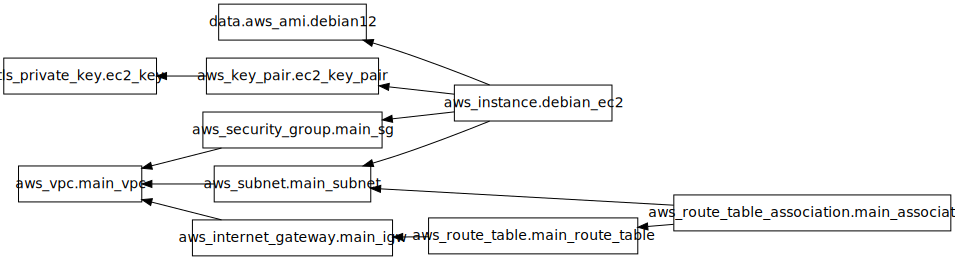

# 1) Análise Técnica do Código Terraform

Nesta seção, analisamos cada componente do código.

```tf
provider "aws" {
  region = "us-east-1"
}
``` 

No componente acima, defimos o provider como sendo AWS e a região us-east-1 como a região da AWS que queremos utilizar. No Terraform, um provider representa um plugin que pode ser utilizado para criar e gerenciar recursos. Existem diferentes providers que foram construídos para diferentes plataformas, como: Azure e Google Cloud Platform. No caso do nosso código, os recursos providos pela AWS no terraform nos vão permitir definir a nossa infraestrutura na nuvem. 

```tf
resource "tls_private_key" "ec2_key" {
  algorithm = "RSA"
  rsa_bits  = 2048
}
```

Aqui, definimos o algoritmo que será utilizado para a geração da chave pública e da chave privada. Para a geração da chave, será utilizado o algoritmo RSA, que é um algoritmo de criptografia assimétrica que gerará as chaves com tamanho de 2048 bits. Essas duas chaves serão utilizadas para garantir uma comunicação segura com as instâncias da AWS. A chave pública está presente na instância e a chave privada é armazenada localmente. A chave pública é utilizada para codificar a mensagem e a chave privada para decodificar.

```tf
resource "aws_key_pair" "ec2_key_pair" {
  key_name   = "${var.projeto}-${var.candidato}-key"
  public_key = tls_private_key.ec2_key.public_key_openssh
}
```

Aqui definimos o key_pair, que contém dois valores, o nome da chave e a public_key define a chave pública que, para uma instância de linux, será armazenada em ~/.ssh/authorized_keys após a instância ser lançada.

```tf
resource "aws_vpc" "main_vpc" {
  cidr_block           = "10.0.0.0/16"
  enable_dns_support   = true
  enable_dns_hostnames = true

  tags = {
    Name = "${var.projeto}-${var.candidato}-vpc"
  }
}
```

Criação de uma rede privada virtual dentro da nuvem. O diagrama abaixo mostra um exemplo de uma VPC na infraestrutura da nuvem.
[](https://docs.aws.amazon.com/vpc/latest/userguide/what-is-amazon-vpc.html)

Os componentes do recurso são:
- cidr_block = Bloco de endereços para rede virtual
- tags = nome da vpc.

```tf
resource "aws_subnet" "main_subnet" {
  vpc_id            = aws_vpc.main_vpc.id
  cidr_block        = "10.0.1.0/24"
  availability_zone = "us-east-1a"

  tags = {
    Name = "${var.projeto}-${var.candidato}-subnet"
  }
}
```

Criando subnet dentro da VPC definida anteriormente.
- vpc_id = ID da VPC definida anteriormente.
- cidr_block = Máscara de subrede definida para a subrede.
- availability_zone = Região da AWS que a subrede vai estar localizada.
- tags = Definição do nome da subrede.

```tf
resource "aws_internet_gateway" "main_igw" {
  vpc_id = aws_vpc.main_vpc.id

  tags = {
    Name = "${var.projeto}-${var.candidato}-igw"
  }
}
```

Definição do gateway da infraestrutura que estamos construindo. O Gateway vai permitir a comunicação entre a Internet e a VPC definida. Com o gateway de internet, os recursos da públicos da subrede podem se conectar a internet se o recurso tem um endereço IP. Além disso, permite que recursos da internet se conectem a recursos públic da nossa subrede usando o endereço IP. Ex: Com o gateway de internet, podemos nos conectar a uma instância EC2 da AWS localmente.
- vpc_id = ID da vpc que contém esse gateway.
- tags = Nome definido do gateway.

```tf
resource "aws_route_table" "main_route_table" {
  vpc_id = aws_vpc.main_vpc.id

  route {
    cidr_block = "0.0.0.0/0"
    gateway_id = aws_internet_gateway.main_igw.id
  }

  tags = {
    Name = "${var.projeto}-${var.candidato}-route_table"
  }
}
```

Recurso para criação de uma tabela de roteamento para a infraestrutura. Uma tabela de roteamento define um conjunto de regras que determinam para onde o tráfego da nossa subrede ou gateway é direcionado. 
- vpc_id = ID da vpc que a tabela de roteamente está associada.
- route = Objetos para rota
  - cidr_block = Bloco de endereços cobertos pela tabela. No caso acima, estamos definindo como "0.0.0.0/0", isso significa que estamos redirecionando todo o tráfego de qualquer endereço IP (interno ou externo) para o gateway de internet, permitindo que as instâncias da VPC acesse a internet.
  - gateway_id = Definir ID do gateway associado.
- tags = Nome da tabela de roteamento

```tf
resource "aws_route_table_association" "main_association" {
  subnet_id      = aws_subnet.main_subnet.id
  route_table_id = aws_route_table.main_route_table.id

  tags = {
    Name = "${var.projeto}-${var.candidato}-route_table_association"
  }
}
```

Criação de uma associação entre a subrede definida anteriormente e a tabela de roteamento. Agora, a tabela de roteamento definida anteriormente está associada com a subrede.

```tf
resource "aws_security_group" "main_sg" {
  name        = "${var.projeto}-${var.candidato}-sg"
  description = "Permitir SSH de qualquer lugar e todo o tráfego de saída"
  vpc_id      = aws_vpc.main_vpc.id

  # Regras de entrada
  ingress {
    description      = "Allow SSH from anywhere"
    from_port        = 22
    to_port          = 22
    protocol         = "tcp"
    cidr_blocks      = ["0.0.0.0/0"]
    ipv6_cidr_blocks = ["::/0"]
  }

  # Regras de saída
  egress {
    description      = "Allow all outbound traffic"
    from_port        = 0
    to_port          = 0
    protocol         = "-1"
    cidr_blocks      = ["0.0.0.0/0"]
    ipv6_cidr_blocks = ["::/0"]
  }

  tags = {
    Name = "${var.projeto}-${var.candidato}-sg"
  }
}
```

Define um grupo de segurança para a infraestrutura. Um grupo de segurança atua como um firewall para as instâncias EC2, com o objetivo de controlar o tráfego de saída e de entrada na rede. Todas as instâncias de um grupo de segurança estão sob as mesmas regras. Para permitir o tráfego para uma instância, todas as regras do grupo de segurança são avaliadas antes de permitir a conexão. 
Os componentes são:
- name = Nome do security group.
- description = Descrição do grupo de segurança
- vpc_id = vpc associada com o grupo de segurança.
- ingress = Definir as regras de entrada, no caso acima, estamos permitindo conexão tcp vinda de qualquer endereço IP na porta 22.
- egress = Definir regras de saída, no caso acima, qualquer instância nesse grupo pode enviar tráfego para qualquer endereço IP, qualquer porta e usando qualquer protocolo
- tags = Nome do grupo de segurança.

```tf
data "aws_ami" "debian12" {
  most_recent = true

  filter {
    name   = "name"
    values = ["debian-12-amd64-*"]
  }

  filter {
    name   = "virtualization-type"
    values = ["hvm"]
  }

  owners = ["679593333241"]
}
```

Esse recurso de dados acima é utilizado para obter a AMI (Amazon Machine Image), que consiste na imagem de um container que será utilizado por outros recursos. Para determinar a imagem, dentro do escopo definimos quais as características essa imagem deve ter.
- most_recente = Indica que se deseja obter a imagem mais recente
- filter = Definir filtro para busca da imagem, no escopo são definidos dois filtros, que são:
  - "name" = Buscar por container que tem um nome que inicia com debian-12-amd64- e o resto pode ser qualquer coisa
  - "virtualization-type" = Tipo de virtualização do container. A virtualização hvm é vantajosa pois oferece melhor perfomance.
- owners = ID do dono do container. Esse ID pertence a Amazon. 

```tf
resource "aws_instance" "debian_ec2" {
  ami             = data.aws_ami.debian12.id
  instance_type   = "t2.micro"
  subnet_id       = aws_subnet.main_subnet.id
  key_name        = aws_key_pair.ec2_key_pair.key_name // receber a chave pública
  security_groups = [aws_security_group.main_sg.name]

  // Definir IP público para a instância
  associate_public_ip_address = true

  // Definindo característica da instância
  root_block_device {
    volume_size           = 20
    volume_type           = "gp2"
    delete_on_termination = true
  }

  // Comando que serão executados pela instância na primeira vez 
  user_data = <<-EOF
              #!/bin/bash
              apt-get update -y
              apt-get upgrade -y
              EOF

  tags = {
    Name = "${var.projeto}-${var.candidato}-ec2"
  }
}
```

Definição de uma instância EC2 na AWS. Um instância EC2 funciona como um servidor virtual na nuvem, podemos utilizar esse servidor para executar programas, armazenar dados e processar dados. Nesse recurso do terraform, podemos definir quais são as características da instância que estamos requisitando:
- ami = ID da instância que obtivemos utilizando o data "aws_ami" anteriormente.
- instance_type = Tipo da instância EC2
- subnet_id = ID da subrede que a instância está localizada.
- key_name = Passar a chave pública para a instância
- security_groups = Definir o security_group que a instância faz parte
- associate_public_ip_address = Definir IP público para a instância
- root_block_device = Definindo característica da instância
- user_data = Comando que serão executados pela instância na primeira vez que ela for executada.
- tags = Nome da instância.

```tf
variable "projeto" {
  description = "Nome do projeto"
  type        = string
  default     = "VExpenses"
}

variable "candidato" {
  description = "Nome do candidato"
  type        = string
  default     = "Jeferson"
}
```

São definidas essas duas variávels que podem ser chamadas no arquivo. Para cada variável, são definidos uma descrição, o tipo da variável e o valor dela.

```tf
output "private_key" {
  description = "Chave privada para acessar a instância EC2"
  value       = tls_private_key.ec2_key.private_key_pem
  sensitive   = true
}

output "ec2_public_ip" {
  description = "Endereço IP público da instância EC2"
  value       = aws_instance.debian_ec2.public_ip
}
```

Outputs tornam informações sobre a nossa infraestrutura disponíveis na linha de comando, expondo essas 
informações.

## Arquitetura atual

No diagrama abaixo está representando o diagrama atual da arquitetura.



## Observações

- Toda a definição da infraestrutura está concentrada no arquivo main.tf. Seguindo boas práticas do terraform e de engenharia de software, podemos dividir os blocos em diferentes módulos. Assim, teremos um projeto bem mais organizado e fácil de se entender.
- Em alguns blocos estão sendo definidas características que são default explicitamente
- O recurso "aws_route_table_association" não contém o campo tags, e vamos remover esse campo.
- Podemos definir várias propriedades dos recursos como variáveis. Ex: região, owner da AMI, tipo da instância e etc.
- Temos algumas falhas de segurança, tais como: expor a chave privada, permitir acesso livre às instâncias a partir do grupo de segurança e definir um output como sendo a chave privada.
- Definir todas as descrições dos recursos em inglês para padronização.

# 2) Modificação e Melhoria do Código Terraform

### Aplicação de melhorias de segurança

- Para buscar no código quais eram as melhorias de segurança, foram utilizados:
  - Terrascan. Essa ferramenta é específica para códigos IaC (Infrastructure as code) e pode ser utilizada em projetos Terraform. Após instalar essa biblioteca, podemos rodar o commando `terrascan scan` no terminal dentro do diretório do projeto. Após isso, o terrascan vai checar se o código segue um conjunto de políticas específicadas e acusar quais políticas estamos violando no código. Após o scan inicial, essas foram as políticas de segurança violadas:
    - Ensure that your AWS application is not deployed within the default Virtual Private Cloud in order to follow security best practices
    - Security Groups - Unrestricted Specific Ports - (SSH,22)
    - EC2 instances should disable IMDS or require IMDSv2 as this can be related to the weaponization phase of kill chain
  - Análise da documentação do Terraform. Durante a pesquisa para entender a função de cada recurso da AWS utilizado, é possível também visualizer recomendações de segurança na documentação de cada recurso. Essas recomendações também foram consideradas para realizar alterações no código. 
  - Pesquisas em fóruns do Terraform e medium.
Além disso, algumas outras mudanças de segurança incluem:
- Geração e armazenamento das chaves SSH. 
- Adicionar a porta 443 no grupo de segurança para permitir acesso HTTPS no servidor da instância.

### Automação da Instalação do Nginx

- Para definir os comandos que serão executados após a criação da instância, definimos o campo user_data no recurso de criação de instância para AWS.
- Para evitar escrever os comandos diretamente no arquivo .tf, podemos definir um script como entrada para user_data. O script será executado após a criação da instância.
- O arquivo user_data.sh vai realizar a instalação do servidor nginx e também do cloudwatch (Que será explicado posteriormente). Para instalar e inicializar o nginx os seguintes comandos serão executados:
   ```sh
      sudo apt update -y &&
      sudo apt install -y nginx
      echo "VExpenses Challenge" | sudo tee /var/www/html/index.html
      sudo systemctl start nginx
      echo "Nginx server is running"```
- No script acima:
  - Estamos atualizando as referências dos pacotes do ubuntu
  - Instalando o Nginx localmente na instância 
  - Escrevendo "Vexpenses Challenge" no index.html, que é o arquivo utilizado para exibir o conteúdo padrão na página inicial do servidor web Nginx.
  - Inicializando o serviço do Nginx para que ele comece a atender as requisições HTTP.
### Descrição Técnica das mudanças de segurança

Nessa seção é detalhado as ações tomadas para resolver os problemas de segurança:
- EC2 instances should disable IMDS or require IMDSv2, as this can be related to the weaponization phase of the kill chain.
  - Para resolver esse problema, o seguinte trecho de código foi adicionado no recurso `aws_instance`:

    ```hcl
    metadata_options {
      http_tokens = "required"
    }
  - A utilização do IMDSv2 e a exigência de tokens de sessão ajudam a proteger os dados sensíveis das instâncias EC2 contra acessos não autorizados. Isso é especialmente relevante na fase de (kill chain), onde um atacante pode tentar explorar vulnerabilidades para obter acesso aos metadados da instância. Então, recomenda-se definir `http_tokens` como `required` para melhorar a segurança da instância.
-  Ensure that your AWS application is not deployed within the default Virtual Private Cloud in order to follow security best practices
   -  Acredito que a violação da política talvez tenha sido um erro, pois no código do `main.tf` é definida uma VPC com uma subrede dentro dela e a instância e a instância também está dentro dessa subrede. Talvez essa violação tenha aparecido pelo fato de não possuir uma conta da AWS, o que provavelmente pode ter causado algum problema de sincronização.
-  Security Groups - Unrestricted Specific Ports - (SSH, 22)
   - O problema ocorre porque a instância Debian está configurada para aceitar conexões SSH diretamente de qualquer host, o que representa um risco de segurança. Para resolver essa questão, é necessário modificar a infraestrutura. Uma solução comum é restringir os endereços IP autorizados a realizar conexões SSH à instância. Entretanto, como não há uma lista definida de IPs permitidos, foi adotada uma abordagem mais segura: a criação de uma instância bastion_ec2. A abordagem com bastion_ec2 envolve mover a instância debian_ec2 para uma sub-rede privada, de modo que ela só possa ser acessada por meio da instância bastion. A instância bastion_ec2, por outro lado, está localizada em uma sub-rede pública, permitindo o acesso direto da internet. Para acessar a instância debian_ec2, é necessário primeiro se conectar ao bastion_ec2, adicionando uma camada extra de segurança.
   - A instância `bastion_ec2` é do mesmo tipo da instância `debian_ec2`.
   - A nova instância `bastion_ec2` está presente em uma nova subrede que é pública e `debian_ec2` está numa subrede privada
   - `debian_ec2` ainda consegue enviar informações para qualquer host fora da subrede privada, mas só consegue receber requisições vindas da rede do `bastion_ec2`.
- Ao utilizar o recurso de `tls_private_key` podemos gerar as chaves públicas e privadas que serão utilizadas para a conexão com a instância. No entanto, ao consultar a documentação do terraform, há um aviso em relação ao uso desse recurso, ao utilizá-lo, a chave privada pode ser obtida a partir do arquivo de estados do terraform, o que acaba sendo uma grande falha de segurança. Para resolver isso, podemos gerar a chave ssh externamente e obter diretamente a chave no arquivo terraform. Ao fazer isso isso, evitamos que a chave privada possa ser exposta a partir do arquivo de estado. No projeto, a chave foi gerada localmente utilizando o comando `ssh-keygen -t rsa -b 4096 -f ~/.ssh/my_ec2_key` (Dobrando o tamanho da chave). Além disso, segundo a recomendação da documentação, gerar a chave a partir do código é recomendada apenas em situações de teste. Por isso, deixei comentado no código o recurso indicando que pode ser utilizado para testes.
- Salvar chaves SSH no AWS secret manager
  - Como um mecanismo de segurança, a chave ssh privada foi armazenada no serviço da aws security manager. Essa prática garante que a chave esteja protegida e criptografada, reduzindo o risco de exposição acidental. Além disso, ao utilizar o Secrets Manager, é possível acessar a chave SSH de forma programática e controlar quem tem permissão para visualizá-la, garantindo um gerenciamento mais eficiente e seguro das credenciais. Para implementar essa solução, foi criado um recurso aws_kms_key para habilitar a criptografia das chaves, como visto no trecho abaixo: 
    ```tf
      resource "aws_kms_key" "kms_key" {
        description = "Description key for secret manager"
        enable_key_rotation = true
      }
    ```
  - A configuração enable_key_rotation = true é utilizada para habilitar a rotação automática da chave de criptografia com o objetivo de manter um nível mais alto de segurança.
### Outras Melhorias

Além das mudanças com o objetivo de melhoras a segurança, algumas outras melhorias foram realizadas com os objetivos de: Melhorar a estrutura de módulos do projeto e criação de diferentes arquivos, fazer monitoramento das atividades na infraestrutura, melhorar a legibilidade do código, adicionar mais variáveis e outputs.

- Módulos: 
  - Inicialmente, toda a estrutura do projeto estava concentrada em um único arquivo main.tf. Seguindo as recomendações do Terraform, o projeto foi reorganizado em três arquivos:

    1) main.tf: Contém a lógica dos providers e recursos.
    2) variables.tf: Define todas as variáveis usadas no projeto.
    3) outputs.tf: Contém os outputs definidos anteriormente no main.tf.
    
   - Essa divisão resultou em uma estrutura mais organizada. Com o crescimento do projeto e a adição de novas melhorias, o arquivo main.tf foi segmentado em dois módulos:

      1) Módulo Network: Responsável pela configuração da rede, incluindo VPC, subnets e security groups.
      2) Módulo EC2: Responsável pela configuração dos recursos da instância EC2.
  
  - No arquivo main.tf na raiz do projeto, definimos o provider, chamamos os dois módulos e estabelecemos dependências entre eles. Especificamente, o módulo EC2 depende do ID da subrede e do nome do grupo de segurança, que são outputs do módulo Network. Com essa nova estrutura, o projeto se tornou mais organizado e fácil de gerenciar.

  - Criar arquivo `providers.tf` que contém as configurações para provider. No caso do projeto, o provider será a AWS.

  - Para gerar uma documentação automática para cada módulo (doc-ec2.md e doc-network.md), explicitando as varíaveis, outputs e as descrições, foi utilizado a ferramenta terraform-docs, para realizar a instalação, podemos seguir o seguinte [link](https://terraform-docs.io/user-guide/installation/). Nesse projeto foi utilizado o docker para gerar a documentação executando o seguinte comando: `docker run --rm --volume "$(pwd):/terraform-docs" -u $(id -u) quay.io/terraform-docs/terraform-docs:0.19.0 markdown /terraform-docs > doc-module_name.md`. Nessa documentação de cada módulo, podemos encontrar de forma detalhada todos os recursos utilizados, dependências, variáveis e outputs.

- Monitoramento
  - Coletar logs de acesso e da instância são de exterma importância para verificar a "saúde" da infraestrutura, por isso foram adicionados os seguintes registros de logs:
    - Em relação aos logs de rede, foi criado um aws_flow_log, que fornece um registro de fluxo para VPC, sub-rede, ENI e gateway de trânsito. Esse registro captura o tráfego IP de interfaces de rede, sub-redes ou VPCs específicas. Os logs gerados são enviados para um Grupo de Logs do CloudWatch, permitindo uma análise eficaz do tráfego de rede. A adição desse log se deu ao erro Ensure VPC flow logging is enabled in all VPCs obtido no terrascan
    - Logs da Instância Debian: Foi implementado um agente do CloudWatch na instância Debian para coletar métricas adicionais, como uso de memória e espaço em disco. A configuração do agente foi feita por meio de um arquivo cw_agent_config.json, que instruía o agente a coletar essas métricas a cada 10 segundos. Essa abordagem é fundamental para monitorar o desempenho da instância e detectar possíveis problemas. O script user_data.sh também configura o cloudwatch ao realizar as seguintes ações: Redirecionar logs para um mesmo local, baixar e instalar o agente do CloudWatch a partir da AWS e configurar o agente para usar as configurações armazenadas no AWS SSM (AWS Systems Manager). O AWS SSM é um serviço que permite o gerenciamento seguro e eficiente de recursos da AWS, facilitando a automação de tarefas de manutenção, configuração e monitoramento. Com isso, o agente do CloudWatch pode coletar e enviar logs de maneira integrada e gerenciada. A referência usada para cw_agent_config.json e para o script de instalação está [aqui](https://jazz-twk.medium.com/cloudwatch-agent-on-ec2-with-terraform-8cf58e8736de).
    - Além disso, o código presente em `instance_profile.tf` configura permissões para a instância EC2 interagir com o AWS Systems Manager (SSM) e o CloudWatch para registro de logs. Ele define políticas IAM que permitem à instância acessar o SSM e enviar métricas ao CloudWatch, criando um perfil IAM para associar essas permissões.
    - O erro "Ensure that detailed monitoring is enabled for EC2 instances" obtido no terrascan também motivou a adição da propriedade `monitoring = true` em /modules/ec2/main.tf para habilitar o monitoramento para a instância.

- Variáveis
  - No código, foram introduzidas várias variáveis que não existiam anteriormente, com o objetivo de tornar o código mais legível e facilitar futuras modificações. As variáveis adicionadas foram, por exemplo: ami_owner, instance_type, public_key_path, aws_region dentre outras.

- Outputs
  - Remoção do output da chave privada, já que não está mais sendo gerada
  - Adição de outputs do subnet_id e do sg_name, que são informações que serão capturadas no `main.tf` na raíz do projeto e passadas para o módulo ec2.

- Abrir conexão HTTP da instância com Nginx para o bastião
  - A instância agora está configurada para receber requisições HTTP através da porta 80, que foi exposta para a instância de bastion host. Isso permite a comunicação segura entre o bastião e a instância, facilitando o acesso a serviços web hospedados na máquina
  s

# Como rodar e ferramentas

- Para executar a infraestrutura, precisamos executar os seguintes comandos:
  - `ssh-keygen -t rsa -b 4096 -f ~/.ssh/my_ec2_key` para geração da chave ssh.  
  - ```terraform init```
  - ```terraform apply```
  - Para destruir a infraestrutura, executar: ```terraform destroy```
- Foi utilizado a ferramenta [terrascan](https://runterrascan.io/) para detectar violações de conformidade e segurança em Infraestrutura como Código (IaC) para mitigar riscos antes de provisionar a infraestrutura nativa da nuvem.
  - O comando utilizado foi o `terrascan scan -v`
- Foi utilizando o [terraform-docs](https://terraform-docs.io/) para geração da documentação dos módulos.


## Infraestrutura Final

Abaixo temos o diagrama final da arquitetura terraform: 


## Ideias futuras

Integrar o projeto ao HCP Terraform para trabalhar com múltiplas pesssoas e fazer armazenar variáveis, outputs e segredos no HCP.

## Referências

Alguns links utilizados para estudo e para consulta de código:

- https://www.preveil.com/blog/public-and-private-key/
- https://docs.aws.amazon.com/AWSEC2/latest/UserGuide/ec2-key-pairs.html
- https://docs.aws.amazon.com/vpc/latest/userguide/what-is-amazon-vpc.html
- https://registry.terraform.io/providers/hashicorp/aws/latest/docs/resources/subnet
- https://registry.terraform.io/providers/hashicorp/aws/latest/docs/resources/route_table
- https://docs.aws.amazon.com/pt_br/AWSEC2/latest/UserGuide/ec2-security-groups.html
- https://registry.terraform.io/providers/hashicorp/aws/latest/docs/data-sources/ami
- https://medium.com/@nayana_dev/infrastructure-as-code-with-terraform-on-aws-securing-ec2-instances-with-security-groups-cde399d6e06
- https://jazz-twk.medium.com/cloudwatch-agent-on-ec2-with-terraform-8cf58e8736de
- https://developer.hashicorp.com/terraform/language/modules/develop/composition
- https://spacelift.io/blog/terraform-gitignore
- https://spacelift.io/blog/terraform-graph